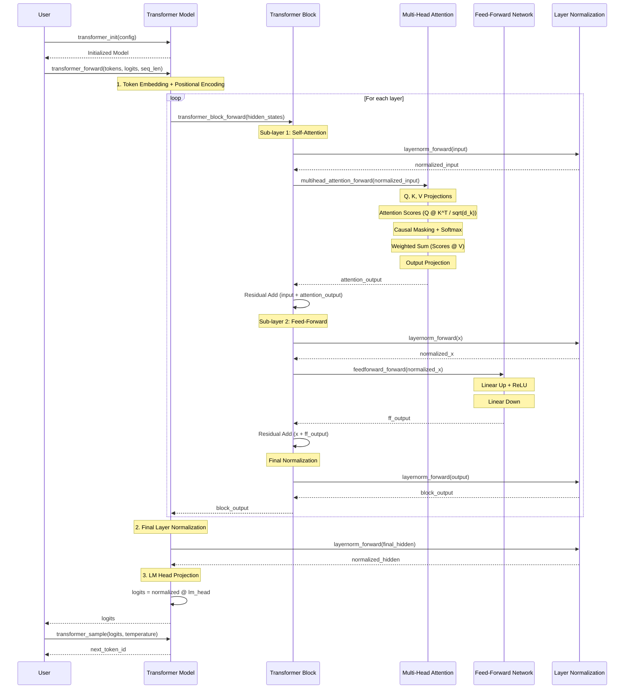

# Transformer

A pure C implementation of a **decoder-only Transformer** inspired by the paper ["Attention Is All You Need"](https://arxiv.org/abs/1706.03762) (Vaswani et al., 2017).

> **Note:** This is a simplified subset of the original paper. The paper describes an encoder-decoder model for machine translation, while this repo implements a decoder-only (GPT-style) architecture for next-token prediction.

## What's Implemented vs Original Paper

| Component | Original Paper | This Repo |
|-----------|---------------|-----------|
| Architecture | Encoder-Decoder | Decoder-only |
| Self-attention | Masked (decoder) + bidirectional (encoder) | Causal masked only |
| Cross-attention | Yes (decoder attends to encoder) | No |
| Optimizer | Adam with warmup + decay | Basic SGD (fixed LR) |
| Dropout | p=0.1 on all sub-layers | Reserved, not used |
| Label smoothing | ε=0.1 | No |
| Tokenization | BPE (37K vocab) | Character-level (28 chars) |
| Decoding | Beam search (beam=4) | Temperature sampling |
| Weight tying | Shared input/output embeddings | Separate matrices |
| Gradient clipping | Max norm 1.0 | No |
| Batched training | ~25K tokens per batch | Single sequence |

## Architecture

**Decoder-only (GPT-style)** with the following components:

- **Causal masked self-attention** - prevents attending to future tokens
- **Pre-normalization** - LayerNorm before each sub-layer for training stability
- **Position-wise feed-forward network** with ReLU activation
- **Sinusoidal positional encoding** - no learned position embeddings
- **Residual connections** around every sub-layer
- **Temperature-scaled sampling** for text generation

### Model Structure

```
Input Tokens → Token Embedding + Positional Encoding
             → [Transformer Block] × N layers
             → Final Layer Normalization
             → LM Head (Linear Projection)
             → Logits → Softmax → Sampled Token
```

Each Transformer Block:
```
Input → LayerNorm → Multi-Head Self-Attention → Residual Add
      → LayerNorm → Feed-Forward Network      → Residual Add
      → LayerNorm → Output
```

### Forward Pass Sequence



## File Structure

| File | Description |
|------|-------------|
| `transformer.h` | Single-header library (stb-style). Contains all declarations and implementations |
| `main.c` | Inference demo with vocabulary mapping and component visualization |
| `train.c` | Character-level training loop with full backpropagation |

## Quick Start

### Inference Demo

```bash
gcc -o main main.c -lm -O2
./main
```

Outputs:
- Token encoding
- Positional embeddings
- Token embeddings
- Combined embeddings
- Attention output
- Feed-forward output
- Decoder logits
- Predicted next token

### Training Demo

```bash
gcc -o train train.c -lm -O2
./train
```

Trains a tiny character-level model (d_model=16, 2 heads, 1 layer) on a short text sample and generates text every 50 epochs.

## Using the Library

`transformer.h` uses the stb-style single-header pattern. In exactly **one** source file, define `TRANSFORMER_IMPLEMENTATION` before including:

```c
#define TRANSFORMER_IMPLEMENTATION
#include "transformer.h"
```

In all other files, include normally:

```c
#include "transformer.h"
```

### Basic Usage

```c
// Configure model
TransformerConfig config = {
    .vocab_size = 1000,
    .d_model = 64,
    .num_heads = 4,
    .num_layers = 2,
    .d_ff = 128,
    .max_seq_len = 32,
};

// Initialize
Transformer model;
transformer_init(&model, config);

// Forward pass
int tokens[] = {1, 5, 23, 100};
float *logits = malloc(seq_len * config.vocab_size * sizeof(float));
transformer_forward(&model, tokens, logits, seq_len);

// Sample next token
int next = transformer_sample(&logits[(seq_len - 1) * config.vocab_size], config.vocab_size, 0.8f);

// Cleanup
free(logits);
transformer_free(&model);
```

## Configuration

| Parameter | Description | Typical Value |
|-----------|-------------|---------------|
| `vocab_size` | Number of unique tokens | 32K - 100K+ |
| `d_model` | Embedding dimension | 64 - 4096+ |
| `num_heads` | Attention heads | 2 - 32+ |
| `num_layers` | Transformer blocks | 1 - 48+ |
| `d_ff` | FFN hidden dimension | 4 × d_model |
| `max_seq_len` | Maximum sequence length | 512 - 8192+ |

## Features

- **Single header** - no build system needed, just `#include`
- **No external dependencies** - only standard C library (`stdio.h`, `stdlib.h`, `math.h`, `string.h`)
- **Deterministic testing** - `matrix_init_fixed()` for reproducible outputs
- **Xavier initialization** - proper weight scaling for training
- **Numerically stable softmax** - max-subtraction prevents overflow
- **Per-position layer normalization** - correct normalization over feature dimension only

## Limitations

- Naive O(n³) matrix multiplication (no SIMD or blocking)
- No GPU acceleration
- No dropout (reserved in config)
- No KV cache for inference optimization (reserved in struct)
- Training uses basic SGD (no Adam/AdamW)

## License

MIT
